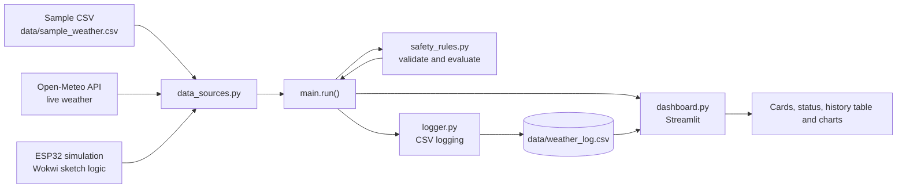

# Block Diagram

```mermaid
flowchart LR
    A["Sample CSV<br/>data/sample_weather.csv"] --> D["data_sources.py"]
    B["Open-Meteo API<br/>live weather"] --> D
    C["ESP32 simulation<br/>Wokwi sketch logic"] --> D
    D --> E["main.run()"]
    E --> F["safety_rules.py<br/>validate and evaluate"]
    F --> E
    E --> G["logger.py<br/>CSV logging"]
    G --> H[("data/weather_log.csv")]
    E --> I["dashboard.py<br/>Streamlit"]
    H --> I
    I --> J["Cards, status, history table and charts"]
```

The ESP32 block represents the simulated sensor. Readings are simulated, not
measured, and SAFE / UNSAFE is a demonstration indicator only.
